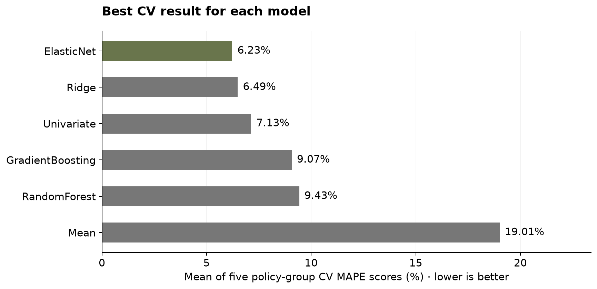
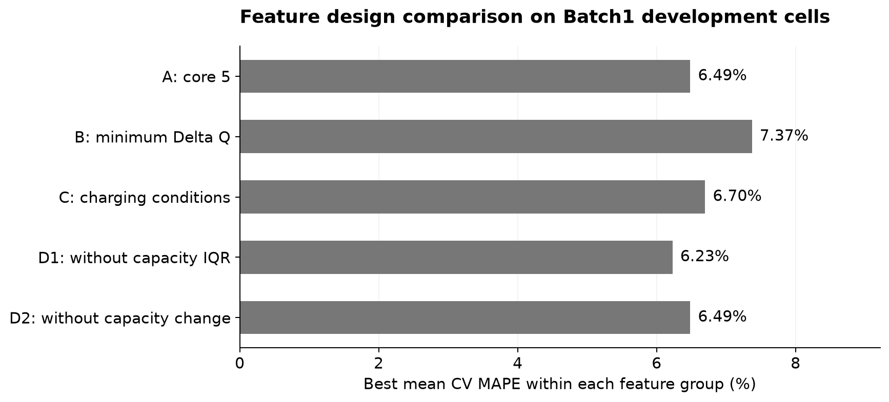
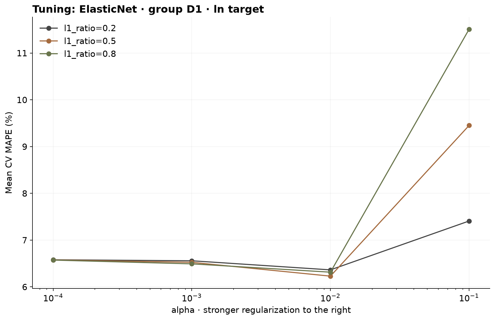
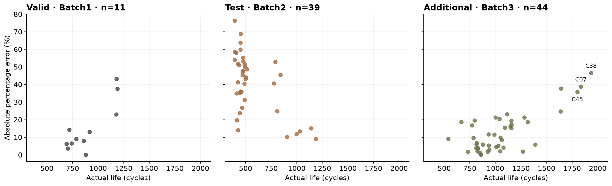
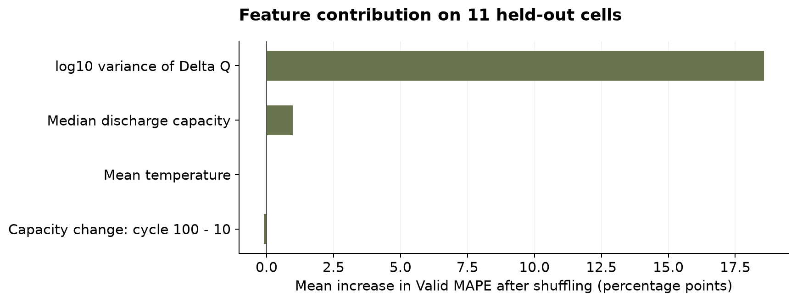

# 초기 100사이클 기반 배터리 총수명 예측

DS Mini Project · 울산 캠퍼스 3반 · **U090 이나현**

초기 충·방전 관측으로 배터리의 총수명(`cycle_life`, 사이클)을 예측하는 회귀 실험이다. DAY1의 EDA를 근거로 피처·전처리·후보 모델·튜닝 범위를 고정하고, 충전 정책별 교차검증으로 후보를 선정했다. 딥러닝은 사용하지 않았다.

**선정 결과:** ElasticNet · 피처군 D1 · ln수명 · `alpha=0.01`, `l1_ratio=0.5`. CV MAPE는 **6.23%**지만 Batch2 Test는 **40.81%**다. 개발 교차검증의 성능이 다른 Batch에 그대로 일반화되지 않았다.

## 제출 자료

- [실행 결과가 포함된 분석 노트북](Day2_Battery_Cycle_Life.ipynb): EDA 해석 → 피처 생성 → 모델 비교·튜닝 → 최종 평가 → 오류·도메인 해석
- [모델·피처·하이퍼파라미터 설명](docs/modeling.md): 각 선택의 이유와 설정값의 역할
- [DAY1 설계 보고서](output/pdf/DS-MINI-Design-울산_3반-U090%20이나현.pdf)
- [선정 결과](day2/results/selection.json), [전체 CV 비교](day2/results/cv_results.csv), [셀별 예측](day2/results/predictions.csv)

## 실행 환경과 재현 방법

검증한 환경은 Python 3.11.15, scikit-learn 1.9.1이다. CPU로 실행하며 설치 버전은 [requirements.txt](requirements.txt), 실행 환경·소스 해시는 [run_manifest.json](day2/results/run_manifest.json)에 기록했다.

```bash
python3.11 -m venv .venv
source .venv/bin/activate
python -m pip install -r requirements.txt
python -m day2.experiment --data-dir data-30 --jobs 4
python -m unittest discover -s tests -v
```

노트북은 프로젝트 루트에서 열고 위 가상환경을 커널로 선택한 뒤 전체 실행한다. 원본 피처를 재생성하고 탐색·평가까지 수행한다. CSV·JSON·그래프·저장 모델은 `day2/results/`에 생성된다. 병렬 프로세스 수는 계산 설정이며 비교 모델의 파라미터를 바꾸지 않는다.

단계를 따로 실행하려면 `--stage prepare`, `--stage tune`, `--stage evaluate`, `--stage plots`를 사용한다. 튜닝은 `prepare` 이후, 평가는 `tune` 이후 실행한다.

## 원본 데이터

[Kaggle MIT-Stanford 배터리 데이터](https://www.kaggle.com/datasets/itshpark/data-driven-prediction-of-battery-cycle/data)를 내려받아 다음 파일을 `data-30/`에 둔다. 용량이 큰 원본 `.mat` 파일과 `.venv`는 Git에 포함하지 않는다.

```text
data-30/
  2017-05-12_batchdata_updated_struct_errorcorrect.mat
  2018-02-20_batchdata_updated_struct_errorcorrect.mat
  2018-04-12_batchdata_updated_struct_errorcorrect.mat
```

`2018-04-03_varcharge`는 별도 충전 최적화 실험 데이터이므로 이번 학습·평가에서 제외한다. 원본은 HDF5 기반 MATLAB v7.3 형식이며 `h5py`로 필요한 배열만 읽는다.

| 데이터 | 관측 셀 | 수명 확인 셀 | 수명 중앙값 | <500 / >1000 셀 |
| --- | ---: | ---: | ---: | ---: |
| Batch1 | 46 | 46 | 858.5 | 0 / 10 |
| Batch2 | 47 | 39 | 472.0 | 28 / 3 |
| Batch3 | 46 | 44 | 1005.5 | 0 / 23 |

## EDA 결과와 구현 전략의 연결

| 질문 | 확인한 내용 | 구현에 반영한 선택 |
| --- | --- | --- |
| 수명 분포 | Batch2에 <500셀 28개, Batch1에는 0개. Batch3에 장수명 셀이 많음 | 회귀 선택, Batch별 평가·수명 구간별 오차 확인, 장수명 이상치 후보 유지 |
| 열화 곡선 | 초기 용량 상승·스파이크·이후 가속 등 단일 직선으로 설명하기 어려운 변화 | 용량 중앙값·IQR 비교. 전체 곡선의 knee는 EDA만 수행하고 입력 제외 |
| ΔQ(V) | Batch1 log분산과 수명 Pearson r=-0.886 | log분산 기본 피처, 한 변수 모델 기준, 최솟값 대체 비교 |
| 충전 조건 | 충전시간과 수명 Pearson r은 Batch1 +0.744, Batch2 -0.919, Batch3 +0.638 | 관계의 Batch 의존성 확인. 충전 조건은 C군에서 별도 비교, 정책 그룹 분리 |
| 피처 상관·중복 | IQR-변화량 r=-0.961/-0.408/-0.993. 평균·최고온도도 중복 | Ridge·ElasticNet 규제, D1·D2 제거 비교, 최고온도·IR 기본 입력 보류 |

수명 미확인 10셀은 관측 EDA에 유지하고 정답이 필요한 학습·평가에서 제외했다. Batch1의 46개 빈 첫 기록만 측정값을 결측으로 표시하고 원래 사이클 번호를 유지했다. 초기 유효 Qd는 Batch1 99개, Batch2·3 100개다. 스파이크는 제거하지 않았다.

## 피처·모델·튜닝

원래 번호 1-100의 측정만 사용하며 공통 1,000점 전압 격자에서 ΔQ=Q100(V)-Q10(V)를 계산한다. 표본분산의 `ddof=1`, IQR의 사분위수 계산은 선형 보간이다. 용량은 Ah, 온도는 °C, 충전시간은 분, 전환 기준은 %, 전류 조건은 C-rate다.

- A: ΔQ log분산·용량 중앙값·IQR·100-10 용량차·평균온도
- B: A의 log분산을 ΔQ 최솟값으로 대체
- C: A + 충전시간 중앙값·C1·전환%·C2
- D1: A에서 IQR 제외 / D2: A에서 용량차 제외

Mean은 피처 없는 기준선, Univariate는 강한 ΔQ 신호 한 개의 기준선이다. Ridge·ElasticNet은 소표본과 중복 피처, Forest·Boosting은 비선형 관계를 비교하기 위해 선정했다. 자연로그 타깃과 원수명 타깃을 각각 비교했다. 전체 파라미터 범위와 역할은 [모델 설명](docs/modeling.md)에 제시했다.

튜닝 조합 290개와 기준 후보 4개에 동일한 5-fold를 적용했다. 총 **1,470회 CV 학습** 중 튜닝 모델 학습은 1,450회다. 선형 입력의 표준화는 매 학습 폴드에서만 fit했다.

## 데이터 분리와 모델 선정

Batch1에서 정책 그룹의 20%를 seed=42로 보류했다. 개발 35셀·18정책 / Valid 11셀·5정책이며 [고정 셀 목록](day2/config/holdout.json)과 일치한다. 개발 데이터의 원문 정책 문자열로 `GroupKFold(5, shuffle=False)`를 구성했다. 같은 정책이 각 폴드의 학습·검증에 겹치지 않는다.

선정 점수는 **5개 폴드 MAPE(%)의 산술평균**이다. 표본 수와 관계없이 각 폴드 가중치는 1/5다. 반올림 전 최솟값으로 모델·피처군·타깃 변환·파라미터를 선택했다. pooled OOF MAPE는 6.177%로 별도 값이며 선정 기준이 아니다.

선정 결과를 저장한 뒤 개발 35셀 전체로 최종 모델을 학습했다. Valid·Batch2·Batch3 결과로 재튜닝하거나 피처를 바꾸지 않았다. [CV 분할 기록](day2/results/cv_splits.json)과 [전체 경고 기록](day2/results/fit_warnings.json)을 보존했다. 이번 실행의 수렴 경고는 0건이다.

## 모델 비교 결과

각 모델에서 가장 낮은 CV 평균 점수를 얻은 조합을 제시한다. 폴드 표준편차는 점수 변동의 기술 통계이며 신뢰구간이 아니다.

| model | feature_group | target_transform | mean_cv_mape_pct | std_cv_mape_pct | params_json |
| --- | --- | --- | --- | --- | --- |
| ElasticNet | D1 | ln | 6.230 | 1.891 | {"alpha": 0.01, "l1_ratio": 0.5} |
| Ridge | D1 | identity | 6.493 | 1.724 | {"alpha": 0.1} |
| Univariate | univariate | ln | 7.134 | 2.410 | {} |
| GradientBoosting | D2 | ln | 9.072 | 4.414 | {"learning_rate": 0.1, "max_depth": 2, "n_estimators": 200} |
| RandomForest | D2 | ln | 9.430 | 5.078 | {"max_depth": 2, "min_samples_leaf": 3} |
| Mean | baseline | identity | 19.006 | 9.189 | {} |

원수명 평균 기준선과 ln수명 기준선은 별도로 비교했다. 로그 기준선은 역변환 시 기하평균 예측이다.

| model | target_transform | mean_cv_mape_pct | std_cv_mape_pct |
| --- | --- | --- | --- |
| Univariate | ln | 7.134 | 2.410 |
| Univariate | identity | 7.201 | 2.812 |
| Mean | identity | 19.006 | 9.189 |
| Mean | ln | 19.207 | 8.514 |



ElasticNet이 탐색 범위에서 가장 낮은 CV MAPE를 얻었다. IQR을 제외한 D1은 기본 A군보다 낮은 오차를 보였다. 이것은 피처 중복을 제거한 비교의 결과이며 피처들의 독립성이나 인과관계를 증명하지 않는다.



위 그래프는 각 피처군 안에서 모델·파라미터를 고른 최저점이다. 피처 차이를 더 직접적으로 확인하기 위해 선정 모델의 같은 목표 변환과 파라미터를 적용한 후보도 대조한다.

| feature_group | mean_cv_mape_pct | std_cv_mape_pct |
| --- | --- | --- |
| A | 6.755 | 1.238 |
| B | 8.311 | 2.410 |
| C | 7.280 | 0.776 |
| D1 | 6.230 | 1.891 |
| D2 | 6.686 | 1.310 |

같은 ElasticNet·ln수명·alpha=0.01·l1_ratio=0.5에서 D1은 6.230%, A는 6.755%였다. 차이는 약 0.526pp이며 작은 개발 표본의 CV 비교 결과다. 충전 조건을 추가한 C군은 이 동일 설정에서 개선되지 않았다.

## 최종 하이퍼파라미터와 해석

- `alpha=0.01`: ln수명 기준의 전체 규제 강도. 학습 폴드의 입력을 표준화한 상태에서 비교했다.
- `l1_ratio=0.5`: L1과 L2 규제의 비중을 함께 사용하는 설정이다.
- `max_iter=10000`, `tol=1e-4`, `selection='cyclic'`, `fit_intercept=True`: 설계에서 고정한 수렴·절편 설정이다.



최종 입력은 ΔQ log분산·용량 중앙값·100-10 용량차·평균온도다. 이번 fit에서 평균온도 계수는 0이 되어 실제 예측 기여가 사라졌다. 피처군은 선정된 D1 그대로 보존했으며 평가 결과를 보고 다시 제거하지 않았다. [표준화 입력 계수](day2/results/linear_coefficients.csv)는 ln수명 단위이며 원래 수명의 사이클 증가량과 동일하게 해석하지 않는다.

## 최종 성능

MAPE는 백분율 오차, MAE·RMSE는 사이클 단위다. CV 행의 MAE·RMSE도 폴드 점수의 평균이다. Train은 학습한 같은 35셀의 오차이며 CV와 구분한다.

| split | n | mape_pct | mae_cycles | rmse_cycles |
| --- | --- | --- | --- | --- |
| Train | 35 | 5.858 | 50.787 | 66.478 |
| CV (5-fold mean) | 35 | 6.230 | 54.652 | 70.631 |
| Valid | 11 | 14.965 | 155.196 | 228.070 |
| Test_Batch2 | 39 | 40.813 | 208.366 | 222.437 |
| Additional_Batch3 | 44 | 12.652 | 160.200 | 256.478 |


Valid-Train은 9.11pp, Valid-CV는 8.74pp, Batch2 Test-Valid는 25.85pp다. 양수는 앞에 적힌 평가 오차가 더 크다는 의미다.

## 오류 분석과 Batch 차이


Batch2의 <500사이클 28셀 MAPE는 45.56%이며 평균적으로 수명을 약 204사이클 과대 예측했다. 개발 데이터에는 <500셀과 같은 짧은 수명 영역이 없었다. Batch2에서는 용량 중앙값 21/39셀, ΔQ log분산 11/39셀이 개발 입력의 최댓값을 넘었다. 수명·입력 분포 차이는 일반화 실패를 해석하는 근거이며 오차의 단일 인과 원인으로 단정하지 않는다. 상세 수치는 [입력 범위 비교](day2/results/feature_range_shift.csv)에 기록했다.

Valid의 >1000사이클 3셀 MAPE는 34.60%로 과대 예측이 두드러졌다. 반대로 Batch3의 >1000사이클 23셀 MAPE는 18.01%이며 평균 약 247사이클 과소 예측했다. 특히 C07·C38·C45(1836·1935·1801사이클)의 오차는 38.76·46.54·35.76%였다. 장수명 셀을 제거하지 않고 평가에 포함했다.





Valid 11셀에서 피처를 30회 섞었을 때 ΔQ log분산의 평균 MAPE 증가가 가장 컸다. 용량차의 증가값은 약 -0.10pp로 작은 음수였다. 이 검증 표본에서 기여가 명확하지 않다는 의미이며 피처가 유해하다는 인과적 결론은 아니다. 평가 후 모델 변경에는 사용하지 않았다.

## 논문 성능과 비교

논문은 초기 100사이클을 이용한 수명 예측에서 9.1% 테스트 오차를 보고했다. 본 Batch2 Test는 40.81%로 참고값보다 31.71pp 크고, Batch3 추가 평가는 12.65%로 3.55pp 크다. CV 6.23%만으로 논문보다 우수하다고 판단할 수 없다. [원논문](https://web.mit.edu/braatzgroup/Severson_NatureEnergy_2019.pdf)

논문의 정제된 124셀(학습41·1차 테스트43·2차 테스트40)과 달리 이번 실험은 원본 139셀 중 수명 확인 129셀을 사용하며 정책 그룹으로 분리했다. 저자 코드의 연속 실험 연결·제외 처리까지 동일하게 재현한 실험이 아니다. DAY1 EDA에서 Valid·Batch2·Batch3 수명을 이미 확인했으므로 완전히 미관측한 테스트라고 주장하지 않는다. 비교값은 조건 차이를 명시한 참고다.

## 실험을 통해 배운 점과 다음에 확인할 내용

DAY1에서 ΔQ log분산과 수명의 관계가 강하게 나타나 이 신호를 중심으로 회귀 모델을 설계했다. 용량 피처의 중복을 줄이는 비교와 규제 모델, 비선형 모델을 같은 정책별 교차검증에 적용했다. 그 결과 IQR을 제외한 D1군의 ElasticNet이 선정됐다. 원본 피처 재생성, 학습 폴드에서만 수행하는 표준화, 로그 예측의 역변환, 고정된 셀 분리를 코드로 연결했고 전체 실행에서도 같은 결과가 재현됐다. 이 과정을 통해 EDA에서 정한 선택을 실제 실험으로 확인할 수 있었다.

CV MAPE는 6.23%였지만 Batch2에서는 40.81%로 커졌다. 오차를 셀별로 확인하니 39개 중 37개의 수명을 길게 예측했고, 500사이클 미만 28개는 평균 약 204사이클 과대 예측했다. 개발 데이터에는 500사이클 미만 셀이 하나도 없었다. **짧은 수명을 학습할 관측이 부족한 상태에서 그 영역까지 예측하게 한 점이 이번 설계의 한계였다.** 앞으로는 모델을 고르기 전에 학습 데이터가 예측 대상의 수명 범위와 입력 조건을 충분히 포함하는지 먼저 확인해야겠다고 생각했다.

입력 범위도 함께 살펴봤다. Batch2에서는 초기 용량 중앙값 21/39셀과 ΔQ log분산 11/39셀이 개발 데이터의 최댓값을 넘었다. 선정 모델의 용량 중앙값 계수는 양수여서 용량이 높으면 수명을 길게 예측하는 방향으로 작용한다. Batch2는 초기 용량이 높으면서 실제 수명은 짧은 셀이 많았기 때문에, 초기 용량의 절대값을 다른 Batch에도 같은 의미로 적용해도 되는지 의문이 생겼다. 분포 차이와 계수의 방향은 오차를 설명하는 근거지만, 이것만으로 용량 피처가 성능 저하의 주원인이라고 확정할 수는 없다.

피처를 추가하거나 제거한 결과도 배울 점이 있었다. 같은 ElasticNet·ln수명·alpha=0.01·l1_ratio=0.5에서 기본 A군은 6.755%, IQR을 제외한 D1군은 6.230%였다. 중복 피처를 점검한 선택이 이 CV 비교에서는 도움이 됐다. 반면 충전 조건을 추가한 C군은 같은 설정에서 7.280%였다. 최종 온도 계수는 0이 됐다. **EDA에서 관련이 있어 보이는 변수도 실제 예측에 얼마나 기여하는지는 별도로 확인해야 한다는 점을 배웠다.** 이 결과는 개발 표본 35개에서 얻은 비교이므로 다른 데이터에서도 같은 효과가 나타난다고 일반화하지 않는다.

이번 정책별 CV는 Batch1 안에서 새로운 충전 정책을 예측하는 상황을 평가했다. Batch2처럼 수명과 입력 분포가 다른 실험 집단으로 옮겨 가는 상황까지 충분히 검증하지 못했다. 따라서 CV가 낮다는 사실과 함께, 그 점수가 어떤 데이터와 분리 방식에서 나온 것인지 설명해야 한다. 논문의 9.1%와 비교할 때도 셀 구성·전처리·분리 조건을 확인해야 한다고 느꼈다. 이번에는 논문 성능에 도달하지 못했지만, 오차가 커지는 영역과 현재 설계가 다루지 못한 조건을 구체적으로 확인했다.

다음 실험에서는 아래 가설을 하나씩 검증해 보고 싶다. 아직 수행하지 않은 계획이며 성능 향상을 보장하는 결과는 아니다.

| 다음에 확인할 문제 | 실험해 볼 방법 | 확인할 결과 |
| --- | --- | --- |
| 학습에 단수명 영역이 부족함 | 단수명 셀과 다양한 충전 조건을 포함한 추가 학습 데이터를 확보하고, 평가 데이터는 별도로 고정 | 단수명 구간의 과대 예측·MAPE·MAE가 함께 줄어드는지 |
| 초기 용량의 절대값이 Batch 차이를 반영할 수 있음 | 기존 절대 용량 피처와 `Qd / Qd10` 같은 상대 용량 요약을 같은 개발 분할에서 비교 | Batch 차이에 덜 민감해지면서 수명 신호를 유지하는지. 상대화가 유용한 정보까지 없애는지도 확인 |
| 정책별 CV가 다른 Batch의 성능을 충분히 보여주지 못함 | 추가 데이터가 확보되면 Batch 단위로 학습·검증을 나누는 평가도 설계 | 같은 Batch 내부 점수와 다른 Batch에서의 점수 차이가 얼마나 큰지 |

이번 Batch2·3 평가 결과는 그대로 보존한다. 후속 실험에서 이미 확인한 평가 데이터로 설정을 다시 고르면 그 점수는 탐색 결과로 구분하고, 최종 성능은 별도의 미사용 데이터로 확인해야 한다. 다음 실험의 방향과 범위는 이 가설들을 비교한 뒤 정한다.

## ESS 활용과 한계

초기 셀 관측으로 수명 위험을 선별하고 추가 점검의 우선순위를 정하는 연구용 보조 신호로 검토할 수 있다. 다만 데이터는 실험실의 LFP/graphite 셀과 고속 충전 조건에서 얻은 자료다. 실제 ESS의 충·방전 부하, 온도 변화, 휴지·달력 열화, 셀 편차와 팩 운용을 대표하지 않는다. [실험 조건](https://web.mit.edu/braatzgroup/Severson_NatureEnergy_2019.pdf)

이번 Batch2 과대 예측은 수명이 짧은 셀의 위험을 낮게 평가할 수 있다는 한계를 보여준다. 실제 교체 시점이나 안전 제어에 바로 적용할 근거는 부족하다. 적용하려면 별도의 ESS 운용 데이터와 외부 검증, 수명 정의 일치, 입력 범위 점검이 필요하다. 향후 다른 데이터로 개선을 검토하더라도 이번 평가셋으로 설정을 다시 고른 결과와 혼합하지 않아야 한다.

## 검증 및 역할

- 원본 재생성 피처와 DAY1 피처 수치가 일치한다.
- 원래 cycle100 사용, 미래 측정값 미사용, 원본 보존, 로그 역변환, 학습 폴드 표준화, 정책 분리 계약을 테스트했다.
- 저장 모델을 다시 불러온 예측이 원래 예측과 일치한다.
- 전체 실행 노트북의 재현 확인은 [verification.json](day2/results/verification.json)에 기록한다.
- 담당: U090 이나현 — EDA 해석, 피처·모델 전략 결정, 결과 검토 및 제출.

## 파일 구조

```text
Day2_Battery_Cycle_Life.ipynb  # 실행 결과·그래프·해석
day2/data.py                 # 원본에서 초기 피처 생성
day2/modeling.py             # 분리·모델·Grid·점수
day2/experiment.py           # 추출 → 튜닝 → 최종 평가
day2/plots.py                # 결과 그래프
day2/predict.py              # 저장 모델로 피처 CSV 예측
day2/config/                 # DAY1의 고정 설계와 셀 분리
day2/results/                # 실험 결과·예측·그래프·모델
docs/modeling.md             # 선택 이유와 파라미터 역할
tests/test_day2_contract.py  # 데이터 누출·분리·점수 계약 검증
```

저장 모델로 정답 없이 예측하려면 같은 단위로 계산한 선택 피처 CSV를 사용한다.

```bash
python -m day2.predict --features input_features.csv --output predictions.csv
```

## 참고문헌

- [Severson et al. (2019). Data-driven prediction of battery cycle life before capacity degradation](https://web.mit.edu/braatzgroup/Severson_NatureEnergy_2019.pdf)
- [저자 공개 코드와 데이터 처리](https://github.com/rdbraatz/data-driven-prediction-of-battery-cycle-life-before-capacity-degradation)
- [Kaggle 데이터](https://www.kaggle.com/datasets/itshpark/data-driven-prediction-of-battery-cycle/data)
- [scikit-learn 공식 문서와 모델별 참고](docs/modeling.md#참고)
