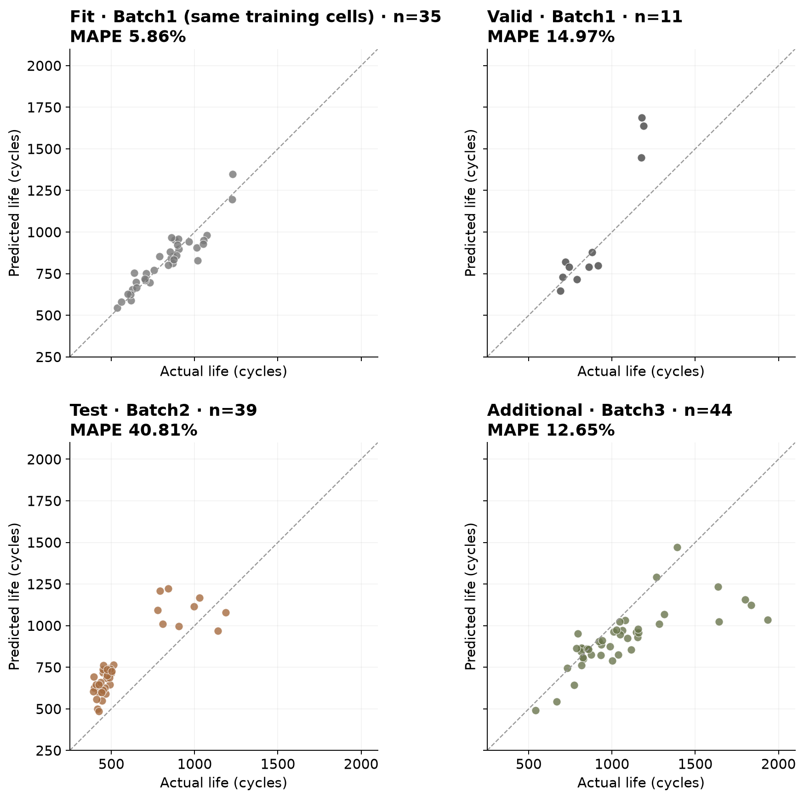
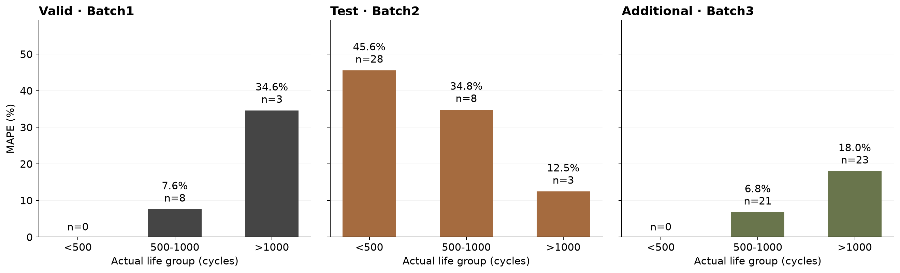

# ESS 배터리 수명 예측

초기 100사이클의 충·방전 관측으로 배터리 총수명을 예측한다. DAY1의 EDA와 모델 설계 전략을 구현하고, Batch2 성능을 과제에서 제시한 논문 기준과 비교하여 오류 원인과 개선 방향을 분석했다.

## 프로젝트 개요

- 데이터셋: MIT-Stanford Battery Dataset (Severson et al., Nature Energy 2019)
- 학습 데이터: Batch1 (2017-05-12), 개발 35셀 / 별도 검증 11셀
- 평가 데이터: Batch2 (2018-02-20), 수명 확인 39셀
- 추가 평가: Batch3 (2018-04-12), 수명 확인 44셀
- 태스크: **Regression — 총 Cycle Life 예측**, 입력은 원래 사이클 번호 1–100

## 파일 구조

```text
├── data/README.md                     # 원본 다운로드·배치 안내
├── notebooks/
│   └── ESS_Battery_Cycle_Life.ipynb    # 실행 결과·그래프·해석
├── day2/
│   ├── data.py                       # 전처리·피처 생성
│   ├── modeling.py                   # 정책별 분리·후보 모델·튜닝
│   ├── experiment.py                 # 학습·선정·최종 평가
│   ├── reporting.py                  # 과제 양식 성능 표·Gap
│   ├── plots.py                      # 결과 시각화
│   ├── config/                       # 고정 설계·hold-out 셀 목록
│   ├── figures/eda/                  # 노트북에 사용한 EDA 그래프
│   └── results/                      # 성능 표·모델 비교·예측·저장 모델
├── docs/modeling.md                  # 피처·모델·파라미터 선정 근거
├── tests/test_day2_contract.py       # 미래 정보·표준화·분리 검증
├── requirements.txt
└── README.md
```

## 환경 설정

Python 3.11에서 실행했다. [원본 데이터 준비](data/README.md)에 따라 3개 `.mat` 파일을 `data-30/`에 둔다.

```bash
git clone https://github.com/ncelinelee/mini_project_data.git
cd mini_project_data
python3.11 -m venv .venv
source .venv/bin/activate
pip install -r requirements.txt
python -m ipykernel install --user --name ess-battery --display-name "ESS Battery (Python 3.11)"
python -m day2.experiment --data-dir data-30 --jobs 4
python -m unittest discover -s tests -v
```

노트북은 `ESS Battery (Python 3.11)` 커널을 선택하고 전체 실행한다. 하나의 노트북에 EDA 해석·피처 생성·모델 비교·평가를 순서대로 담았다. 원본 데이터와 가상환경은 저장소에 포함하지 않는다.

## EDA

수명이 확인된 Batch1/2/3의 46/39/44셀을 비교했다. 관측값 EDA에는 수명 결측 셀도 남겼다. 그래프와 상세 해석은 [노트북](notebooks/ESS_Battery_Cycle_Life.ipynb)에 제시한다.

| 분석 | 핵심 발견 | 설계에 반영한 내용 |
| --- | --- | --- |
| Cycle Life 분포 | 중앙값 858.5/472.0/1005.5사이클. <500 비율 0/71.8/0%, >1000 비율 21.7/7.7/52.3% | 회귀 선택, 배치·수명 구간별 평가. 실제 원본에서 Batch1·2의 분포도 다름 |
| 열화 곡선 | 최단 수명 셀은 용량 감소가 더 일찍 나타남. 대표 셀의 변화점 후보는 652/338/841사이클이며 이후 감소가 가속됨 | 중앙값·IQR·초기 용량차 비교. 전체 수명에서 계산한 knee는 입력 제외 |
| ΔQ(V) | Q100(V)−Q10(V) 계산. Batch2 단수명/장수명 그룹 중앙 곡선 최솟값 −0.0558/−0.0192 Ah. Batch1 log분산–수명 r=−0.886 | log분산 주요 피처, 한 변수 기준선과 최솟값 대체군 비교 |
| 충전 조건 | Batch2의 같은 4.8C(80%)−4.8C도 기록 구분에 따라 평균 수명 483.6(n=5)/871.7(n=3). C1–수명 Spearman은 −0.483/+0.055/−0.229 | C-rate만으로 수명 원인을 단정하지 않음. 충전 조건 추가군과 정책별 검증 |
| 피처 중복 | Batch1 IQR–용량차 r=−0.961. 평균·최고온도도 중복 | 규제 모델과 피처 제거 비교. 통계적 독립성을 확보했다고 주장하지 않음 |

## Modeling

### 피처 엔지니어링 전략

기본 A군은 ΔQ log분산(초기 열화), 용량 중앙값(초기 수준), IQR(변동), Qd100−Qd10(변화 방향), 평균온도(열적 상태)다. B는 log분산을 최솟값으로 대체하고, C는 충전시간·C1·전환%·C2를 추가했다. D1은 IQR, D2는 용량차를 제외해 중복 영향을 비교했다.

수명 미확인 10셀은 학습·평가에서 제외했다. Batch1의 빈 첫 기록만 결측으로 표시하고 원래 번호를 유지했다. 스파이크·장수명 셀은 보존하고, IR은 0값 의미가 불명확해 보류했다. 선형 모델의 표준화는 각 학습 폴드에서만 수행했다. 원수명과 ln수명을 비교하고 예측은 원래 사이클 단위로 역변환했다.

### 모델 선택 및 근거

- 후보 모델: 평균 기준선, ΔQ 한 변수 선형 모델, Ridge, ElasticNet, Random Forest, Gradient Boosting
- 비교 이유: 단일 열화 신호의 설명력, 소표본·중복 피처에 대한 규제, 비선형 관계의 추가 이득 확인
- 선정 절차: Batch1의 정책별 hold-out을 고정한 뒤 개발 35셀에 동일한 5-fold GroupKFold와 작은 Grid Search 적용. 294개 후보의 폴드 평균 MAPE 최솟값으로 선정
- 최종 모델: **ElasticNet · D1 · ln수명**, `alpha=0.01`, `l1_ratio=0.5`
- 선택 이유: CV MAPE **6.23%**로 탐색 범위에서 가장 낮았음. 같은 설정의 기본 A군은 6.755%, IQR 제외 D1은 6.230%로 중복 제거가 이 개발 검증에서는 유리했음

`alpha`는 전체 규제 강도, `l1_ratio`는 L1·L2 규제 비중이다. 최종 입력은 log분산·용량 중앙값·용량차·평균온도이며 온도 계수는 0이 됐다. 후보별 탐색값과 고정 파라미터의 역할은 [모델 설명](docs/modeling.md)에 정리했다. [전체 모델 비교](day2/results/cv_results.csv)

Valid·Batch2·3 점수로 재튜닝하지 않고, 개발 35셀에 학습한 같은 모델을 적용했다. 최적은 비교한 후보 범위에서의 CV 최저점을 의미한다.

## 성능 결과

Train은 **Batch1 CV 5개 폴드의 MAPE 산술평균**, Valid는 정책이 겹치지 않는 11셀 hold-out이다. MAPE는 낮을수록 좋고, Gap의 단위는 pp다.

| 구분 | 비교 | MAPE (%) | 비고 |
| --- | --- | ---: | --- |
| Train (Batch 1 CV) |  | 6.23 | 개발35셀·정책별5-fold MAPE의 산술평균 |
| Valid (Batch 1 Hold-out) |  | 14.97 | 11셀·개발과 충전 정책이 겹치지 않는 hold-out |
| Test (Batch 2) |  | 40.81 | 39셀·선정한 동일 모델로 최종 평가 |
|  | Gap (Train-Valid) | 8.74 | Valid−Train(CV), pp; (+) 내부 검증 악화 |
|  | Gap (Valid-Test) | 25.85 | Test(Batch2)−Valid, pp; (+) 배치 일반화 저하 |
|  | Gap (Target-Test) | 31.71 | Test(Batch2)−9.1%, pp; 과제 Target |
| Test (Batch 3) |  | 12.65 | 44셀·같은 모델의 추가 평가 |
|  | Gap (Batch2-Batch3) | 28.16 | Batch2−Batch3, pp; (+) Batch2 오차가 더 큼 |
|  | Gap (Target-Test) | 3.55 | Test(Batch3)−9.1%, pp; 과제 공통 Target |

과제 행 이름을 유지하면서 Train-Valid=Valid−Train(CV), Valid-Test=Test(Batch2)−Valid, Target-Test=해당 Test−9.1%로 계산했다. Batch2−Batch3의 양수는 Batch2 오차가 더 크다는 뜻이다. [필수 제출 양식](day2/results/model_performance.csv) · [Batch3 추가 양식](day2/results/model_performance_batch3.csv)

내부 Gap만으로 과적합 원인을 단정할 수 없다. 소표본·정책 구성 차이와 후보 선정의 낙관성을 함께 고려한다. 논문은 정제된 124셀(41/43/40), 이번 실험은 원본 중 수명 확인 129셀과 정책별 분리를 사용했으므로 동일 조건의 재현은 아니다. DAY1 EDA에서 평가 대상 수명을 확인한 한계도 있다.



## 오류 분석

- 큰 오차가 난 셀: Batch2 C06(393→693사이클, 76.35%), C29(452→763, 68.76%), C18(449→736, 63.86%) 모두 단수명 과대 예측. Batch2 39셀 중 37셀을 과대 예측했고, <500 구간 28셀 MAPE는 45.56%
- 원인 가설: 개발 데이터에 <500 셀이 없고, Batch2 용량 중앙값 21/39셀·ΔQ log분산 11/39셀이 개발 최댓값을 넘었음. 수명·입력 분포 차이를 확인했지만 특정 피처의 인과효과로 확정하지 않음
- Batch3 한계: >1000 구간 23셀 MAPE 18.01%, 평균 약 247사이클 과소 예측. 공통 전압 격자와 셀 내부 차분을 사용했지만 배치별 곡선 시작점 보정은 검증하지 않음
- 개선 방향: 단수명·다양한 조건의 학습 데이터를 확보하고 상대 용량 피처와 배치 단위 검증을 비교해 볼 수 있음. 시작점 정렬과 원논문 품질 처리도 확인해야 함. 아직 수행하지 않은 후속 가설이며 향상을 보장하지 않음

**배운 점:** 낮은 CV 오차가 다른 배치의 성능을 보장하지 않았다. 학습 데이터가 예측 대상의 범위·조건을 포함하는지 먼저 확인해야 한다. 같은 설정에서 IQR 제거는 유리했지만 충전 조건 추가는 개선되지 않아, EDA 상관과 실제 예측 기여를 구분해야 한다고 느꼈다. 자세한 실험 해석과 느낀 점은 노트북에 정리했다.



## ESS 도메인 해석

초기 셀의 수명 위험 선별과 추가 점검 우선순위를 정하는 보조 신호로 검토할 수 있다. 그러나 Batch2 과대 예측은 단수명 셀의 위험을 낮게 평가할 수 있어 교체 시점·안전 제어에 바로 적용하기 어렵다.

실험실 LFP/graphite 셀의 고속 충전 자료는 실제 BESS의 부하·온도·휴지·달력 열화·팩 운용을 대표하지 않는다. 실 배포에는 ESS 운용 데이터, 일관된 수명 정의, 입력 범위 확인과 별도의 외부 검증이 필요하다.

## 참고문헌

- [Severson et al. (2019). Data-driven prediction of battery cycle life before capacity degradation. *Nature Energy*, 4, 383–391.](https://web.mit.edu/braatzgroup/Severson_NatureEnergy_2019.pdf)
- [저자 공개 코드](https://github.com/rdbraatz/data-driven-prediction-of-battery-cycle-life-before-capacity-degradation)
- [Kaggle 데이터셋](https://www.kaggle.com/datasets/itshpark/data-driven-prediction-of-battery-cycle/data)

## 팀 구성

- 울산 캠퍼스 3반 U090 이나현: EDA, 피처·모델 전략 결정, 모델 개발·튜닝, Batch2·3 성능 평가 및 해석
